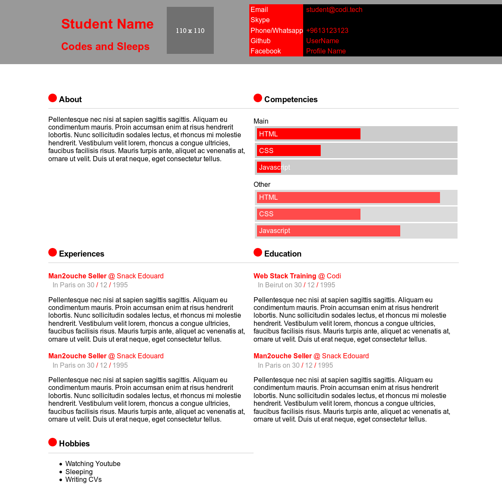
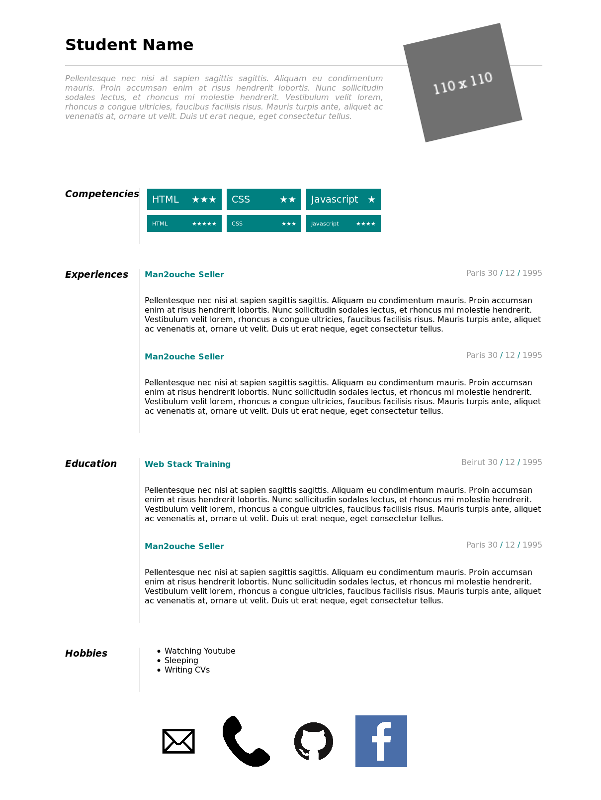

# CV Styling

## Goal:

* Learn and apply CSS Selectors
* Learn and apply CSS rules
* Understand the markup/styling separation
* **Competencies**:
  * Selectors
  * Pseudo Selectors
  * Box Model
  * Media Queries
  * Floats/CSS Grid/Flex
  * Positioning
  * Overflow
  * Background-image

## References

* Layout: [https://learnlayout.com/](https://learnlayout.com/)
* Selectors: [https://flukeout.github.io/](https://flukeout.github.io/)
* Flex: [https://flexbox.io/](https://flexbox.io/)
* CSS Grid: [https://cssgrid.io/](https://cssgrid.io/)

## Tasks:

1. Implement the style depicted in [style1.png](https://github.com/coditech/Documentation/tree/48c0bf3a27cfe19e399a3c6936cebcd010d7f58e/04_Challenges/cv-styling-master/style1-n.png). Try to get as close as possible.
2. Implement the mobile styles in [style1-mobile.png](https://github.com/coditech/Documentation/tree/48c0bf3a27cfe19e399a3c6936cebcd010d7f58e/04_Challenges/cv-styling-master/style1-mobile-n.png)
3. Implement the style depicted in [style2.png](https://github.com/coditech/Documentation/tree/48c0bf3a27cfe19e399a3c6936cebcd010d7f58e/04_Challenges/cv-styling-master/style2-n.png). Try to get as close as possible.
4. Implement the mobile styles in [style2-mobile.png](https://github.com/coditech/Documentation/tree/48c0bf3a27cfe19e399a3c6936cebcd010d7f58e/04_Challenges/cv-styling-master/style2-mobile-n.png)
5. Edit the HTML so it reflects your own information
6. Implement your own Style

Note: Before reaching the last step, you should **not** touch the HTML. You _may_ change names, texts, and images to personalize the CV.

## How To

### 1 - Preparing:

1. Fork this repository then clone the fork to your pc.

### 2 - Implement Style 1:

1. create a file in the directory `public/style1/` called `style.css`
2. Open this file in your text editor \(VScode, Atom, Sublime...\)
3. add a simple instruction to it \(such as: `body{background:red}`\)
4. Open `public/style1/index.html`, and add a line that loads the new css file you created
5. Load `public/style1/index.html` in your browser
6. Begin implementing the styles!
7. When you're done, commit

### 3 - Implement style 2:

1. Copy the directory `public/style1/` and rename it `public/style2/`
2. Open the file `public/style2/style.css` and empty it
3. Follow the same instructions as above
4. Some images are used in this one; feel free to replace them with your own images if you prefer
5. When you're done, commit

### 4 - Edit the HTML:

1. _note_: You CANNOT do this step without a previous commit
2. You NEED at least one commit with the HTML untouched before beginning this part
3. If you don't have a commit with the HTML untouched, DONT touch the HTML, your exercise is VOID
4. Edit `public/style1/index.html` and replace the information inside with your own
5. Once you're done, copy the file to `public/style2` to replace the previous `index.html`
6. When you're done, commit

### Notes:

1. Don't panic! One step at a time
2. Don't forget to push back changes from time to time \(`git add -A`, then `git commit -m "message"` then `git push -u origin master`\)

## Images:

### first style

### second style

